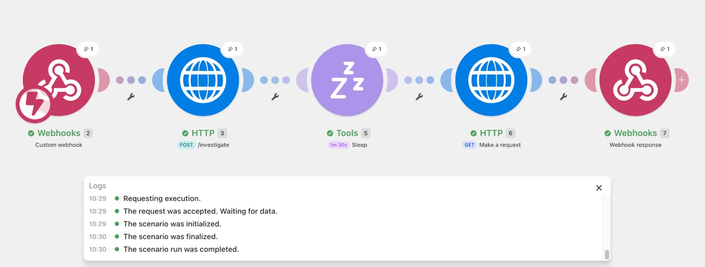

# BioQuery

**An AI-assisted biological investigation workflow that turns a research question into a structured, evidence-grounded research brief.**

BioQuery combines LLM reasoning with scientific databases to plan an investigation, retrieve and rank relevant literature, extract traceable evidence, integrate curated protein and structural data, and synthesize the results with explicit uncertainty.

Rather than asking an LLM to answer a biological question from its internal knowledge, BioQuery separates **reasoning from evidence retrieval**:

- **Claude** plans the investigation, assesses relevance, extracts evidence, and synthesizes the final brief.
- **Europe PMC** provides scientific literature and abstracts.
- **UniProt** provides curated protein annotations and functional-site information.
- **RCSB PDB** provides experimentally determined structural metadata.
- **Python** handles retrieval, cleaning, deduplication, provenance, batching, and workflow logic.
- **Make.com** orchestrates the long-running workflow through an asynchronous FastAPI interface.


## Why BioQuery?

Biological questions rarely map cleanly onto a single literature search.

A question such as:

> **How does allosteric regulation of PFK-1 work at the molecular level?**

can require evidence about conformational states, regulatory ligand-binding sites, cooperative kinetics, mutational studies, protein annotation, and experimentally determined structures.

A conventional keyword search can retrieve relevant papers, but it does not automatically determine **which evidence dimensions are needed**, distinguish direct mechanistic evidence from contextual literature, or integrate literature with biological databases.

BioQuery approaches this as an investigation pipeline:

1. Decompose the biological question into evidence dimensions.
2. Generate targeted literature searches.
3. Retrieve papers from Europe PMC.
4. Clean, deduplicate, and rank candidates for question-specific relevance.
5. Extract structured claims, supporting evidence, and limitations from selected abstracts.
6. Retrieve curated protein annotations from UniProt.
7. Follow UniProt cross-references to experimental structures in RCSB PDB.
8. Synthesize the evidence into a research brief with provenance, confidence, gaps, and a recommended next investigation.


## How it works

```text
Biological question
        |
        v
Investigation planning (Claude)
        |
        v
Targeted Europe PMC searches
        |
        v
Cleaning + deduplication
        |
        v
Question-specific relevance assessment (Claude)
        |
        v
Structured evidence extraction (Claude)
        |
        +----------------------+
        |                      |
        v                      v
     UniProt               Literature
        |
        v
     RCSB PDB
        |
        +----------+-----------+
                   |
                   v
        Cross-source synthesis (Claude)
                   |
                   v
         Evidence-grounded research brief
```

## Evaluation

BioQuery was evaluated on three prospectively specified biological case studies spanning different question types:

| Case study | Question type |
| --- | --- |
| PFK-1 allostery | Structural enzymology / regulation |
| Disease-associated p53 mutations | Mutation → structure/function |
| AMPK energy sensing | Signalling / metabolic regulation |

For each case, I defined three manual keyword queries **before running BioQuery**, retrieved a Europe PMC baseline, and manually labelled the top results using the same binary relevance criterion.

**Relevant = the title and abstract provide evidence or mechanistic insight that directly contributes to answering the stated biological question.**

### Retrieval results

| Case | Baseline P@5 | BioQuery P@5 | Baseline P@10 | BioQuery P@10 |
| --- | ---: | ---: | ---: | ---: |
| PFK-1 | 0.60 | 0.80 | 0.30 | 0.70 |
| p53 | 0.40 | 1.00 | 0.40 | 0.80 |
| AMPK | 0.20 | 1.00 | 0.10 | 0.90 |

| Method | Mean Precision@5 | Mean Precision@10 |
| --- | ---: | ---: |
| Three-query keyword baseline | 0.40 | 0.27 |
| **BioQuery** | **0.93** | **0.80** |

Across these three case studies, BioQuery substantially increased the proportion of directly relevant papers surfaced near the top of the candidate set.

These results are a **small case-study evaluation, not a general benchmark**. Labels were assigned by a single human annotator, and the dataset contains only three biological questions.


### Research brief quality

The three final research briefs were also manually scored from 0–3 on evidence grounding, source diversity, biological specificity, and uncertainty handling.

| Case | Grounding | Source diversity | Biological specificity | Uncertainty | Total |
| --- | ---: | ---: | ---: | ---: | ---: |
| PFK-1 | 3 | 3 | 2 | 3 | 11/12 |
| p53 | 2 | 3 | 2 | 3 | 10/12 |
| AMPK | 2 | 3 | 2 | 3 | 10/12 |

Mean brief-quality score: **10.33/12**.

The strongest dimensions were source diversity and uncertainty handling. Biological specificity was consistently weaker, reflecting an important V1 limitation: literature evidence is extracted from abstracts rather than full-text papers.

Full evaluation data is available in `examples/data/evaluation_results.json`.


## Example investigation

The primary demonstration asks:

> **How does allosteric regulation of PFK-1 work at the molecular level?**

Inputs include:

```python
topic = "PFK-1 allosteric regulation"
question = "How does allosteric regulation of PFK-1 work at the molecular level?"
existing_knowledge = (
    "I understand basic enzyme kinetics, cooperativity, "
    "glycolysis, and allosteric regulation."
)
depth = "advanced undergraduate"
gene = "PFKL"
organism_id = 9606
```

BioQuery turns this into multiple evidence dimensions and targeted searches before retrieving literature.

The completed investigation integrates evidence including:

- literature describing active R-state and inactive T-state conformations of human PFK-1;
- structural evidence for ATP-mediated allosteric inhibition and C-terminal autoinhibition;
- curated UniProt functional and ligand-binding annotations;
- RCSB PDB structures representing R-state, T-state, activator-bound, and filament conformations;
- explicit evidence gaps and limitations caused by abstract-only literature extraction.

The complete machine-readable investigation is available at:

`examples/data/pfk1_complete_investigation.json`


Additional case studies are included for **TP53** and **AMPK**.


## Make.com orchestration

BioQuery exposes its Python workflow through a FastAPI interface so it can be orchestrated by external automation tools.

Because a complete investigation can take longer than a conventional HTTP request timeout, the API uses an asynchronous job pattern:

```text
Make.com webhook
      |
      v
POST /investigate
      |
      v
Receive job_id immediately
      |
      v
BioQuery runs in background
      |
      v
GET /results/{job_id}
      |
      v
Return completed investigation
```

The V1 Make.com scenario uses:

1. **Custom Webhook** — receives the investigation inputs.
2. **HTTP POST** — starts `/investigate`.
3. **Sleep** — allows the background investigation to run.
4. **HTTP GET** — retrieves `/results/{job_id}`.
5. **Webhook Response** — returns the completed JSON result.

The fixed sleep used in the demonstration is intentionally simple. A production implementation should replace it with status-based polling or event-driven completion.

### Make.com scenario




## Installation

### Requirements

- Python 3.12+
- An Anthropic API key
- Internet access for Europe PMC, UniProt, and RCSB PDB

Clone the repository and create a virtual environment:

```bash
git clone https://github.com/lucestap/BioQuery.git
cd BioQuery

python -m venv .venv
source .venv/bin/activate
```

Install dependencies:

```bash
pip install -r requirements.txt
```

Create a `.env` file in the project root:

```text
ANTHROPIC_API_KEY=your_api_key_here
```

`.env` is excluded from version control.


## Usage

### Run the PFK-1 example

```bash
python run_example.py
```

A complete investigation is saved to:

```text
examples/data/pfk1_complete_investigation.json
```

### Example output

BioQuery's final brief includes a mechanistic synthesis, traceable findings, uncertainty, evidence gaps, recommended papers, and a suggested next investigation.

For the PFK-1 case study, the workflow identified evidence supporting:

- an active **R-state** and inactive **T-state** conformational equilibrium in human liver PFK-1;
- **ATP-mediated allosteric inhibition** associated with stabilization of the T-state;
- an **autoinhibitory role of the C-terminus**;
- curated **fructose-2,6-bisphosphate binding-site annotations** from UniProt;
- experimentally determined R-state, T-state, activator-bound, and filament structures from RCSB PDB.

The brief also explicitly flags that literature evidence in V1 is abstract-derived and that PDB records establish structural observations rather than causal mechanisms on their own.


### Run the additional case studies

```bash
python examples/run_p53.py
python examples/run_ampk.py
```

### Run BioQuery programmatically

```python
from pipeline import run_bioquery

result = run_bioquery(
    topic="PFK-1 allosteric regulation",
    question="How does allosteric regulation of PFK-1 work at the molecular level?",
    existing_knowledge="I understand glycolysis and basic enzyme kinetics.",
    depth="advanced undergraduate",
    gene="PFKL",
    organism_id=9606,
)
```

`organism_id` accepts an NCBI taxonomy identifier. Human (`9606`) is used in the examples, but the UniProt retrieval interface is not restricted to human proteins.


### Run the API

```bash
uvicorn api:app --app-dir src --reload
```

Health check:

```text
GET /health
```

Start an investigation:

```text
POST /investigate
```

Retrieve its state/result:

```text
GET /results/{job_id}
```


## Project structure

```text
BioQuery/
├── run_example.py
├── requirements.txt
├── src/
│   ├── api.py          # asynchronous HTTP interface
│   ├── assess.py       # question-specific paper relevance assessment
│   ├── clean.py        # Europe PMC record normalization/deduplication
│   ├── evaluate.py     # evaluation metrics
│   ├── extract.py      # structured evidence extraction
│   ├── pipeline.py     # end-to-end workflow
│   ├── planner.py      # investigation planning and search generation
│   ├── rcsb.py         # RCSB PDB metadata retrieval
│   ├── search.py       # Europe PMC retrieval
│   ├── synthesis.py    # cross-source research brief synthesis
│   └── uniprot.py      # UniProt annotation retrieval
└── examples/
    ├── run_p53.py
    ├── run_ampk.py
    └── data/
        ├── evaluation_results.json
        ├── pfk1_complete_investigation.json
        ├── p53_complete_investigation.json
        └── ampk_complete_investigation.json
```


## Limitations

BioQuery V1 deliberately prioritizes a transparent, working investigation pipeline over exhaustive scientific coverage.

- **Abstract-level literature evidence:** evidence extraction uses Europe PMC abstracts rather than full-text papers. This limits residue-level and experiment-level specificity.
- **Relevance scoring is imperfect:** evaluation showed that the assessor can rank contextual or comparative evidence too highly relative to direct mechanistic evidence.
- **Simple deduplication:** records are matched using PMID, DOI, or normalized title. Preprints are not automatically linked to later published versions.
- **PDB fan-out:** all UniProt-linked PDB records are currently retrieved. This worked well for PFKL but returned 295 structures for TP53, motivating question-aware structure selection.
- **Single-protein database interface:** the V1 UniProt input accepts one gene. Multi-protein complexes such as AMPK are therefore represented through a single selected subunit.
- **In-memory API jobs:** asynchronous job state is stored in memory and is lost if the API process restarts.
- **Small evaluation:** retrieval was evaluated on three biological questions with relevance labels from one human annotator. Results should be interpreted as case studies rather than a general benchmark.
- **Non-deterministic LLM stages:** investigation plans, relevance judgements, evidence extraction, and synthesis can vary between runs.


## Future work

The most useful extensions would be:

- full-text evidence extraction from legitimately accessible Europe PMC articles;
- question-aware PDB structure selection rather than exhaustive cross-reference retrieval;
- improved ranking that distinguishes direct mechanistic evidence from contextual/comparative evidence;
- preprint-to-publication deduplication;
- multi-protein and protein-complex support;
- persistent asynchronous job storage;
- status-based Make.com polling or event-driven completion;
- evaluation across a larger set of biological questions and multiple human annotators.


## Built with

**Python · Anthropic Claude API · Europe PMC · UniProt · RCSB PDB · FastAPI · Make.com**